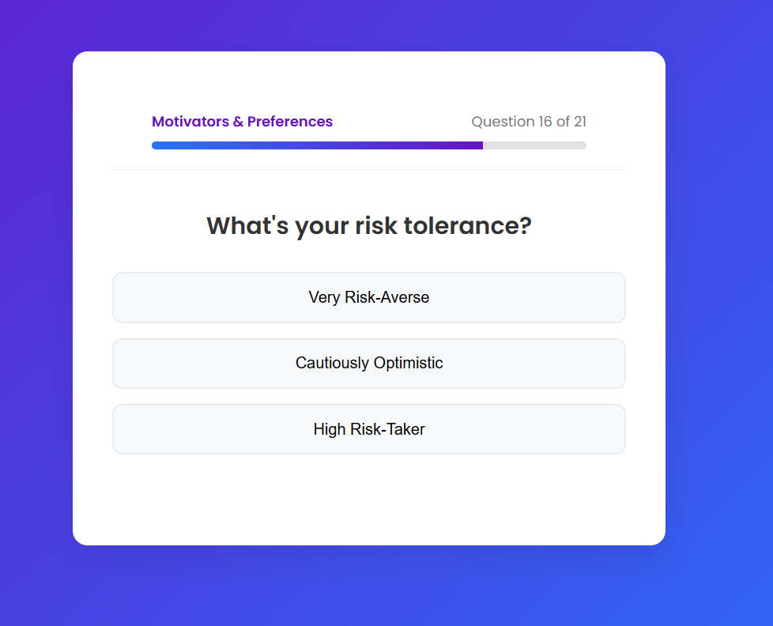
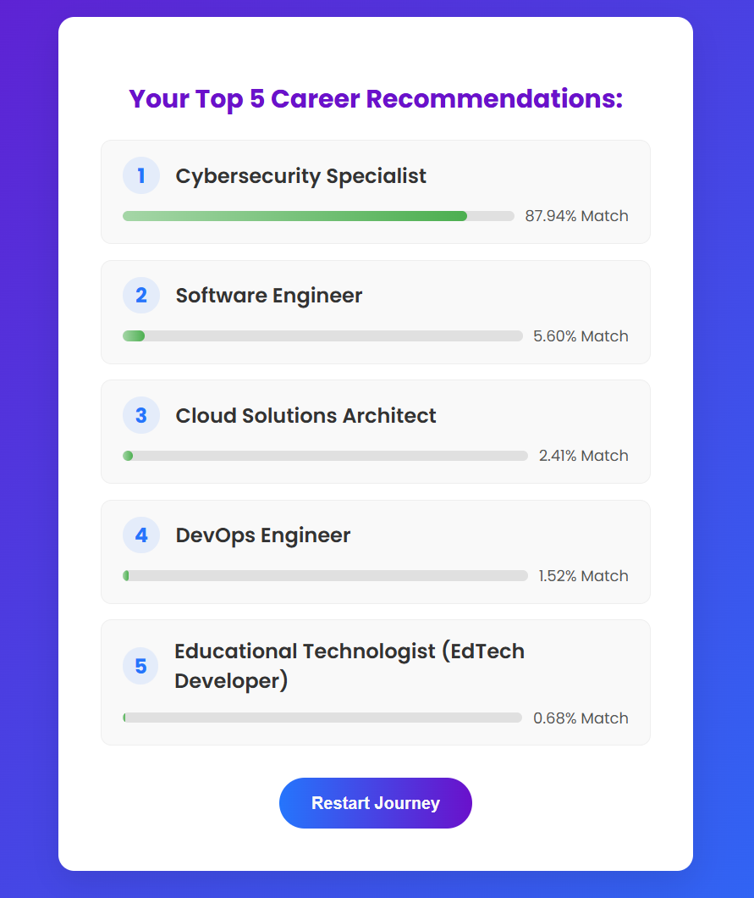

# 🧠 Personality-Based Career Prediction Journey

An **interactive, gamified web application** that guides users through a personality quiz to recommend their top 5 career paths.
This project leverages a **custom-trained neural network** and a **local Large Language Model (Ollama)** to provide **personalized, insightful, and trustworthy career recommendations**.

Instead of a static form, the application provides a **modern, multi-step quiz experience** with smooth animations and a progress tracker — making career exploration engaging and fun.

---

## 📸 Project Preview

| Quiz Screen                                     | Career Recommendation Screen                                         |
| ----------------------------------------------- | -------------------------------------------------------------------- |
|  |  |

> 🖼️ *Place your screenshots inside the folder:* `assets/screenshots/`
> *Then update the file names above accordingly.*

---

## ✨ Key Features

* 🎮 **Gamified Quiz Experience:**
  Questions are presented one by one in a guided journey with animated transitions, progress bars, and a sleek modern UI.

* 🎯 **Top 5 Career Recommendations:**
  The deep learning model predicts the user's **top 5 most suitable careers**, along with **confidence scores**.

* 🤖 **LLM-Powered Insights:**
  A locally-run **Ollama (Llama 3)** instance generates:

  * A concise description of each recommended career.
  * A personalized explanation of why the career is a good fit based on the user's responses.

* ⚙️ **Decoupled Architecture:**
  A robust **Flask backend** serves the AI model via an API, consumed by a **custom HTML, CSS, and JavaScript frontend**.

* 📊 **Expandable Dataset:**
  The project includes scripts to generate a **synthetic dataset** covering **95 unique careers**.

---

## 🛠️ Tech Stack

### **Backend**

* **Framework:** Flask
* **Machine Learning:** TensorFlow (Keras)
* **Data Handling:** Pandas, NumPy, Scikit-learn
* **LLM Integration:** Ollama (via REST API using `requests`)

### **Frontend**

* **Structure:** HTML5
* **Styling & Animations:** CSS3
* **Logic & API Calls:** JavaScript (ES6+)

### **Database**

* **Dataset:** Synthetic dataset (`career_prediction_dataset.csv`) generated via Python scripts.

---

## 🚀 Getting Started

### **1. Prerequisites**

* **Python** (>= 3.9)
* **Ollama** (installed and running locally)

Install Ollama from [ollama.com](https://ollama.com/), then pull and run the model:

```bash
ollama run llama3
```

Keep this terminal open while running the app.

---

### **2. Clone the Repository**

```bash
git clone https://github.com/your-username/your-repo-name.git
cd your-repo-name
```

---

### **3. Set Up the Python Environment**

It’s recommended to use a virtual environment.

```bash
# Create a virtual environment
python -m venv venv

# Activate it
# On Windows:
venv\Scripts\activate
# On macOS/Linux:
source venv/bin/activate

# Install dependencies
pip install -r requirements.txt
```

If `requirements.txt` doesn’t exist yet, create it by running:

```bash
pip freeze > requirements.txt
```

Or manually include:

```
flask
tensorflow
joblib
numpy
scikit-learn
pandas
flask-cors
requests
```

---

### **4. Generate the AI Model Files (Crucial Step!)**

The trained model files (`.h5`, `.gz`) are **not included** in the repository.
Generate them using the training script:

```bash
python retrain_model.py
```

After successful training, you should see:

```
career_prediction_model.h5
scaler.gz
label_encoder.gz
```

---

### **5. Run the Application**

Start the Flask backend (ensure Ollama is running):

```bash
python app.py
```

The server will start on:

```
http://127.0.0.1:5000/
```

Open this URL in your browser to interact with the quiz.

---

## 📈 Project Workflow

1. **Data Generation:**
   Python script generates a synthetic dataset of user profiles and careers.

2. **Model Training:**
   Deep learning model learns patterns between personality traits and career outcomes.

3. **Backend API:**
   Flask loads the trained model and serves predictions via REST endpoints.

4. **Gamified Frontend:**
   JavaScript frontend presents a multi-step quiz with animations and collects responses.

5. **LLM Enrichment:**
   Backend queries **Ollama** for insightful, personalized career explanations.

6. **Interactive Results:**
   Frontend displays top 5 career matches in an expandable, dynamic interface.

---